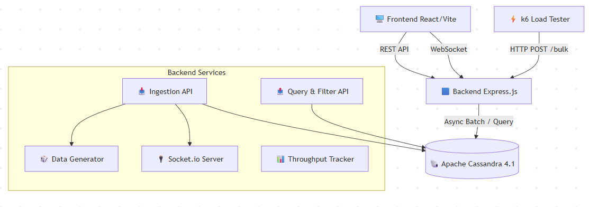

# 🏗️ Kiến trúc Hệ thống - Financial Transaction Ledger

## 📖 1. Tổng quan
Hệ thống **Financial Transaction Ledger** được thiết kế để mô phỏng môi trường lưu trữ nhật ký giao dịch tài chính chịu tải ghi cao, truy vấn đọc tức thì và tự động quản lý vòng đời dữ liệu. Giải pháp sử dụng mô hình **Column-Family (Apache Cassandra 4.1)** kết hợp với backend Node.js/Express và frontend React, đảm bảo đáp ứng các yêu cầu học thuật:
- ✅ Ghi hàng loạt đạt `~500+ tx/s`
- ✅ Truy vấn lịch sử theo `account_id` trả về `< 50ms`
- ✅ TTL tự động xóa log > 1 năm
- ✅ Materialized View hỗ trợ thống kê theo loại giao dịch
- ✅ Giao diện "Transaction Explorer" cập nhật realtime

---

## 🧩 2. Sơ đồ Kiến trúc

---

## 🔌 3. Phân tầng & Trách nhiệm

| Tầng | Thành phần | Người phụ trách | Công nghệ chính |
| --- | --- | --- | --- |
| Database | Schema, TTL, Materialized View, Connection Pool | Lân | Cassandra 4.1, CQL, DBeaver |
| Backend Ingestion | Data Generator, Bulk Async Insert, Throughput Calculator | Khang | Express.js, cassandra-driver, @faker-js/faker |
| Backend Query & Realtime | REST Query API, Filter Logic, Socket.io Bridge, MV Integration | Hiền | Express.js, Socket.io, CQL Prepared Statements |
| Frontend UX/UI | Dual-panel Layout, Virtualized Log, Recharts Chart, WS Client | Thư | React 18+, Vite, react-window, socket.io-client |
| DevOps & Testing | Docker Environment, k6 Benchmark, Tracing Proof, Documentation | Tất cả (Lead: Khang/Lân) | Docker Compose, k6, Markdown/Overleaf |        

---
## 🌊 4. Luồng Dữ liệu
### 🔹 4.1. Luồng Ghi (High-Throughput Ingestion)
1. Frontend nhấn [Tạo luồng giao dịch ngẫu nhiên] → kích hoạt Data Generator.
2. Backend gom batch ~1000 records → gửi bất đồng bộ xuống Cassandra qua cassandra-driver.
3. Mỗi khi batch commit thành công, hệ thống cập nhật bộ đếm throughput trong memory.
4. Socket.io đẩy payload { type: 'log_batch', [...] } và { type: 'metric', throughput: XXX } về frontend.

### 🔹 4.2. Luồng Đọc & Lọc (Instant Query)
1. User nhập account_id + bộ lọc (loại giao dịch, khoảng thời gian).
2. Backend thực thi CQL
``` sql
SELECT * FROM transactions 
WHERE account_id = ? AND transaction_time >= ? AND transaction_time <= ?;
```
3. Cassandra tận dụng Partition Key (account_id) + Clustering Key (transaction_time DESC) → trả về kết quả đã sắp xếp sẵn, không cần ORDER BY hay ALLOW FILTERING.
4. Frontend render bảng sao kê qua react-window (chỉ hiển thị 50–100 dòng visible).

### 🔹4.3. Luồng Realtime
1. Backend dùng setInterval 150ms để gộp log & metric → phát qua Socket.io.
2. Frontend nhận stream → đẩy vào buffer → flush lên state → tránh DOM overload & treo trình duyệt.

## 🗄️ 5. Thiết kế Cơ sở dữ liệu (Cassandra)
### 🔑 5.1. Primary Key Design
``` sql
PRIMARY KEY (account_id, transaction_time)
WITH CLUSTERING ORDER BY (transaction_time DESC);
```
- Partition Key (account_id): Gom tất cả giao dịch của 1 tài khoản về cùng 1 node/partition → đọc cực nhanh.
- Clustering Key (transaction_time DESC): Dữ liệu trong partition luôn được sắp xếp mới nhất trước → query lịch sử không cần sort thêm.
### ⏳ 5.2. TTL (Time-To-Live)
- Cấu hình USING TTL 31536000 (1 năm) tại thời điểm INSERT.
- Cassandra tự động đánh dấu expired và chạy compaction ngầm để dọn rác → không cần cron job hay script DELETE.
### 📊 5.3. Materialized View (MV)
``` sql
CREATE MATERIALIZED VIEW mv_tx_by_type AS
SELECT tx_type, transaction_time, account_id, amount 
FROM transactions 
WHERE tx_type IS NOT NULL AND account_id IS NOT NULL AND transaction_time IS NOT NULL
PRIMARY KEY (tx_type, transaction_time, account_id);
```
- Hỗ trợ truy vấn tổng hợp theo tx_type mà không quét toàn bảng chính.
- **Lưu ý**: MV tạo overhead ghi (write amplification). Dùng đúng mục đích học thuật & demo thống kê nhanh. 

---
## ⚡ 6. Chiến lược Tối ưu Hiệu năng
| Vấn đề | Giải pháp | Kết quả dự kiến |
| --- | --- | --- |
| Ghi chậm do đồng bộ I/O | Async driver + Unlogged Batch + Connection Pooling | Đạt 500–800 tx/s trên 1 node |
| Query đọc chậm khi bảng phình to | Partition Key + Clustering Key DESC + Prepared Statements | p95 latency < 50ms |
| Frontend treo khi render log | react-window + Buffer state + WS batch 150ms | Smooth scroll, 60 FPS |
| Không đo được throughput thực tế | k6 bắn vào API thay vì cassandra-stress | Báo cáo chính xác hiệu năng app |

---
## 7. Triển khai và môi trường
``` yaml
# docker-compose.yml (rút gọn)
services:
  cassandra:
    image: cassandra:4.1
    ports: ["9042:9042"]
    environment:
      CASSANDRA_CLUSTER_NAME: financial_ledger
  backend:
    build: ./backend
    ports: ["3000:3000"]
    depends_on: [cassandra]
  frontend:
    build: ./frontend
    ports: ["5173:5173"]
    depends_on: [backend]
```
- 1 lệnh chạy toàn bộ: `docker compose up -d`
- Dev mode: `npm run dev` (backend) + `npm run dev` (frontend) kết nối vào Cassandra container.

---
## 📝 8. Ghi chú Kỹ thuật & Trade-off
- Materialized View: Cassandra 4.0+ cảnh báo MV do gây write overhead. Nhóm vẫn triển khai để đáp ứng yêu cầu đề bài, đồng thời ghi rõ trade-off trong báo cáo & ưu tiên query trực tiếp bảng chính cho nghiệp vụ cốt lõi.
- TTL: Không dùng DELETE thủ công vì gây tombstone & bloat table. TTL native + compaction là cách quản lý vòng đời an toàn nhất trên Cassandra.
- Realtime over HTTP: Không dùng polling. Socket.io giảm overhead connection, hỗ trợ room/namespace, tự động reconnect.
- Miễn phí 100%: Toàn bộ stack (Cassandra, Node, React, Docker, k6, Socket.io) là open-source, không phụ thuộc dịch vụ tính phí, phù hợp môi trường sinh viên.

---
📅 Cập nhật lần cuối: 2026-04-17